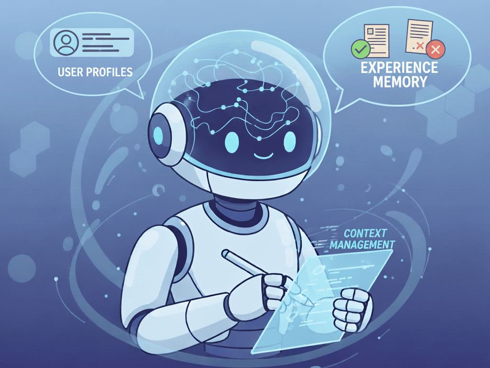

# Awesome-Memory-for-Agents

The paper list is maintained by Hongyi Liu, Yu Fu, Kaiyan Zhang, contributed by Yuxin Zuo, Che Jiang, Guoli Jia, Yuru Wang, Kaikai Zhao, Yuchen Fan, Zhenzhao Yuan, Kai Tian, Weizhi Wang.

    

## Table of Contents

- [Awesome-Memory-for-Agents](#awesome-memory-for-agents)
    - [Table of Contents](#table-of-contents)
    - [Overview](#overview)
    - [Paper List](#paper-list)
        - [Application](#application)
            - [Personalization](#personalization)
            - [Learning from Experience](#learning-from-experience)
            - [Long-horizon Agentic Task](#long-horizon-agentic-task)
        - [Survey](#survey)
        - [Benchmark](#benchmark)
        - [Product \& Project](#product--project)

## Overview

This repository provides a curated list of papers on agent memory, structured by a core taxonomy. We first divide agent memory based on its persistence:

- **Short-Term Memory:** Transient information managed within the context window for a single task;
- **Long-Term Memory:** Persistent information stored externally across tasks.

Within *Long-Term Memory*, we further distinguish based on its reliance on task outcomes (success/failure) for curation:

- **Experience** involves knowledge explicitly validated by task outcomes;
- **Memory** denotes information without reference to task outcomes.

This taxonomy maps directly to the three primary application scenarios that organize the papers in this repository:

| Application               | Memory Content                                                           | Description                                                                                                                                               |
| :------------------------ | :----------------------------------------------------------------------- | :-------------------------------------------------------------------------------------------------------------------------------------------------------- |
| Personalization           | User profiles, interaction history, facts, etc.                          | Continuous personalized interaction, mainly targeting the conversation scenario and using an external memory pool with retrieval-based memory interaction |
| Learning from Experience  | Trajectories, success/failure lessons, reusable skills, etc.             | Cross-task experience accumulation & transfer                                                                                                             |
| Long-horizon Agentic Task | Intermediate results, reasoning traces, environmental observations, etc. | Context management within a single long-horizon task via summarization, reflection, or scratchpad, etc.                                                   |

## Paper List

### Application

#### Personalization

| Date | Title | Paper |
|:------:|:------|:------:|
| 2026-01 | Membox: Weaving Topic Continuity into Long-Range Memory for LLM Agents |  |
| 2026-01 | Grounding Agent Memory in Contextual Intent |  |
| 2026-01 | Continuum Memory Architectures for Long-Horizon LLM Agents |  |
| 2026-01 | SwiftMem: Fast Agentic Memory via Query-aware Indexing |  |
| 2026-01 | AtomMem : Learnable Dynamic Agentic Memory with Atomic Memory Operation |  |
| 2026-01 | Beyond Static Summarization: Proactive Memory Extraction for LLM Agents |  |
| 2026-01 | TeleMem: Building Long-Term and Multimodal Memory for Agentic AI |  |
| 2026-01 | HiMem: Hierarchical Long-Term Memory for LLM Long-Horizon Agents |  |
| 2026-01 | SYNAPSE: Empowering LLM Agents with Episodic-Semantic Memory via Spreading Activation |  |
| 2026-01 | TiMem: Temporal-Hierarchical Memory Consolidation for Long-Horizon Conversational Agents |  |
| 2026-01 | SimpleMem: Efficient Lifelong Memory for LLM Agents |  |
| 2026-01 | MAGMA: A Multi-Graph based Agentic Memory Architecture for AI Agents |  |
| 2026-01 | EverMemOS: A Self-Organizing Memory Operating System for Structured Long-Horizon Reasoning |  |
| 2026-01 | CogCanvas: Verbatim-Grounded Artifact Extraction for Long LLM Conversations |  |
| 2026-01 | Agentic Memory: Learning Unified Long-Term and Short-Term Memory Management for Large Language Model Agents |  |
| 2026-01 | Beyond Dialogue Time: Temporal Semantic Memory for Personalized LLM Agents |  |
| 2026-01 | MemRec: Collaborative Memory-Augmented Agentic Recommender System |  |
| 2025-12 | Memory-T1: Reinforcement Learning for Temporal Reasoning in Multi-session Agents |  |
| 2025-11 | O-Mem: Omni Memory System for Personalized, Long Horizon, Self-Evolving Agents |  |
| 2025-11 | LiCoMemory: Lightweight and Cognitive Agentic Memory for Efficient Long-Term Reasoning |  |
| 2025-11 | Mem-PAL: Towards Memory-based Personalized Dialogue Assistants for Long-term User-Agent Interaction |  |
| 2025-10 | TOM-SWE: User Mental Modeling For Software Engineering Agents |  |
| 2025-10 | PISA: A Pragmatic Psych-Inspired Unified Memory System for Enhanced AI Agency |  |
| 2025-10 | EvolveR: Self-Evolving LLM Agents through an Experience-Driven Lifecycle |  |
| 2025-10 | Improving Code Localization with Repository Memory |  |
| 2025-10 | Mnemosyne: An Unsupervised, Human-Inspired Long-Term Memory Architecture for Edge-Based LLMs |  |
| 2025-10 | AssoMem: Scalable Memory QA with Multi-Signal Associative Retrieval |  |
| 2025-10 | LightMem: Lightweight and Efficient Memory-Augmented Generation |  |
| 2025-09 | MEM-$\alpha$: Learning Memory Construction via Reinforcement Learning |  |
| 2025-09 | Look Back to Reason Forward: Revisitable Memory for Long-Context LLM Agents |  |
| 2025-09 | MIRA: Memory-Integrated Reinforcement Learning Agent  with Limited LLM Guidance |  |
| 2025-09 | REMem: Reasoning with Episodic Memory in Language Agent |  |
| 2025-09 | Adaptive Friend Agent: Personalized Multi-User Memory for Conversational AI |  |
| 2025-08 | Orchid: Orchestrating Context Across Creative Workflows with Generative AI |  |
| 2025-08 | Memory-R1: Enhancing Large Language Model Agents to Manage and Utilize Memories via Reinforcement Learning |  |
| 2025-08 | Learn to Memorize: Optimizing LLM-based Agents with Adaptive Memory Framework |  |
| 2025-07 | MemOS: A Memory OS for AI System |  |
| 2025-07 | Hierarchical Memory for High-Efficiency Long-Term Reasoning in LLM Agents |  |
| 2025-07 | MIRIX: Multi-Agent Memory System for LLM-Based Agents |  |
| 2025-06 | PersonaAgent: When Large Language Model Agents Meet Personalization at Test Time |  |
| 2025-06 | Cognitive Weave: Synthesizing Abstracted Knowledge with a Spatio-Temporal Resonance Graph |  |
| 2025-05 | From Single to Multi-Granularity: Toward Long-Term Memory Association and Selection of Conversational Agents |  |
| 2025-04 | Mem0: Building production-ready ai agents with scalable long-term memory |  |
| 2025-03 | Meminsight: Autonomous memory augmentation for llm agents |  |
| 2025-02 | M+: Extending MemoryLLM with Scalable Long-Term Memory |  |
| 2025-02 | A-MEM: Agentic Memory for LLM Agents |  |
| 2025-01 | Wormhole Memory: A Rubik's Cube for Cross-Dialogue Retrieval |  |
| 2025-01 | Zep: A Temporal Knowledge Graph Architecture for Agent Memory |  |
| 2024-12 | On the Structural Memory of LLM Agents |  |
| 2024-07 | MemoCRS: Memory-enhanced Sequential Conversational Recommender Systems with Large Language Models |  |
| 2024-03 | Larimar: Large language models with episodic memory control |  |
| 2024-01 | From llm to conversational agent: A memory enhanced architecture with fine-tuning of large language models |  |
| 2023-10 | MemGPT: Towards LLMs as operating systems |  |
| 2023-08 | Memochat: Tuning llms to use memos for consistent long-range open-domain conversation |  |
| 2023-06 | Chatdb: Augmenting llms with databases as their symbolic memory |  |
| 2023-05 | MemoryBank: Enhancing large language models with long-term memory |  |
| 2023-04 | Unleashing infinite-length input capacity for large-scale language models with self-controlled memory system |  |

#### Learning from Experience

| Date | Title | Paper |
|:------:|:------|:------:|
| 2026-01 | Controlled Self-Evolution for Algorithmic Code Optimization |  |
| 2026-01 | Beyond Static Tools: Test-Time Tool Evolution for Scientific Reasoning |  |
| 2026-01 | MemGovern: Enhancing Code Agents through Learning from Governed Human Experiences |  |
| 2026-01 | Learning How to Remember: A Meta-Cognitive Management Method for Structured and Transferable Agent Memory |  |
| 2026-01 | Distilling Feedback into Memory-as-a-Tool |  |
| 2026-01 | EvoRoute: Experience-Driven Self-Routing LLM Agent Systems |  |
| 2025-12 | WebOperator: Action-Aware Tree Search for Autonomous Agents in Web Environment |  |
| 2025-12 | Unifying Dynamic Tool Creation and Cross-Task Experience Sharing through Cognitive Memory Architecture |  |
| 2025-12 | LoongFlow: Directed Evolutionary Search via a Cognitive Plan-Execute-Summarize Paradigm |  |
| 2025-12 | CASCADE: Cumulative Agentic Skill Creation through Autonomous Development and Evolution |  |
| 2025-12 | MemEvolve: Meta-Evolution of Agent Memory Systems |  |
| 2025-12 | Memento 2: Learning by Stateful Reflective Memory |  |
| 2025-11 | Improving Language Agents through BREW |  |
| 2025-11 | Scaling Agent Learning via Experience Synthesis |  |
| 2025-11 | FLEX: Continuous Agent Evolution via Forward Learning from Experience |  |
| 2025-11 | Multi-agent In-context Coordination via Decentralized Memory Retrieval |  |
| 2025-11 | AgentEvolver: Towards Efficient Self-Evolving Agent System |  |
| 2025-11 | Experience-Guided Adaptation of Inference-Time Reasoning Strategies |  |
| 2025-11 | WebCoach: Self-Evolving Web Agents with Cross-Session Memory Guidance |  |
| 2025-11 | Real-Time Procedural Learning From Experience for AI Agents |  |
| 2025-11 | SkillGen: Learning Domain Skills for In-Context Sequential Decision Making |  |
| 2025-11 | Live-SWE-agent: Can Software Engineering Agents Self-Evolve on the Fly? |  |
| 2025-10 | Alita-G: Self-Evolving Generative Agent for Agent Generation |  |
| 2025-10 | Dyna-Mind: Learning to Simulate from Experience for Better AI Agents |  |
| 2025-10 | LEGOMem: Modular Procedural Memory for Multi-agent LLM Systems for Workflow Automation |  |
| 2025-10 | The Cognitive Bandwidth Bottleneck: Shifting Long-Horizon Agent from Planning with Actions to Planning with Schemas |  |
| 2025-10 | Agentic Context Engineering: Evolving Contexts for Self-Improving Language Models |  |
| 2025-10 | TokMem: Tokenized Procedural Memory for Large Language Models |  |
| 2025-10 | Training-Free Group Relative Policy Optimization |  |
| 2025-10 | Self-evolving expertise in complex non-verifiable subject domains: dialogue as implicit meta-RL |  |
| 2025-09 | Exploratory Memory-Augmented LLM Agent via Hybrid On- and Off-Policy Optimization |  |
| 2025-09 | Automated Stateful Specialization for Adaptive Agent Systems |  |
| 2025-09 | BMAS: A Brain-Inspired Multi-Agent System with PFC-Guided Task Coordination and Hippocampus-Neocortex Dual Memory for Scalable Multi-Step Reasoning |  |
| 2025-09 | MemGen: Weaving Generative Latent Memory for Self-Evolving Agents |  |
| 2025-09 | MetaEvo: A Meta-Optimization Framework for Experience-Driven Agent Evolution |  |
| 2025-09 | ReasoningBank: Scaling Agent Self-Evolving with Reasoning Memory |  |
| 2025-09 | MLE-RL: Reinforcement Learning for Self-Improvement in Machine Learning Agents |  |
| 2025-09 | ArcMemo: Abstract Reasoning Composition with Lifelong LLM Memory |  |
| 2025-09 | Metacognitive Reuse: Turning Recurring LLM Reasoning Into Concise Behaviors |  |
| 2025-08 | SEAgent: Self-Evolving Computer Use Agent with Autonomous Learning from Experience |  |
| 2025-08 | Memento: Fine-tuning LLM Agents without Fine-tuning LLMs |  |
| 2025-08 | SE-Agent: Self-Evolution Trajectory Optimization in Multi-Step Reasoning with LLM-Based Agents |  |
| 2025-08 | Memp: Exploring Agent Procedural Memory |  |
| 2025-07 | Agent KB: Leveraging Cross-Domain Experience for Agentic Problem Solving |  |
| 2025-07 | SWE-Exp: Experience-Driven Software Issue Resolution |  |
| 2025-06 | Xolver: Generalist Reasoning and Problem Solving through Federated Multi-Agent Dynamics and Holistic Experience Learning |  |
| 2025-06 | G-Memory: Tracing Hierarchical Memory for Multi-Agent Systems |  |
| 2025-06 | Cost-Efficient Serving of LLM Agents via Test-Time Plan Caching |  |
| 2025-06 | MAPLE: Multi-Agent Adaptive Planning with Long-Term Memory for Table Reasoning |  |
| 2025-05 | ML-Agent: Reinforcing LLM Agents for Autonomous Machine Learning Engineering |  |
| 2025-05 | How Memory Management Impacts LLM Agents: An Empirical Study of Experience-Following Behavior |  |
| 2025-05 | Efficiently enhancing general agents with hierarchical-categorical memory |  |
| 2025-04 | SkillWeaver: Web Agents can Self-Improve by Discovering and Honing Skills |  |
| 2025-04 | Inducing Programmatic Skills for Agentic Tasks |  |
| 2025-04 | Memorization and knowledge injection in gated llms |  |
| 2025-04 | Dynamic Cheatsheet: Test-Time Learning with Adaptive Memory |  |
| 2025-03 | Mars: Memory-enhanced agents with reflective self-improvement |  |
| 2024-09 | Agent workflow memory |  |
| 2024-05 | AutoManual: Constructing Instruction Manuals by LLM Agents via Interactive Environmental Learning |  |
| 2024-05 | Iterative experience refinement of software- developing agents |  |
| 2024-04 | An artificial neuron for enhanced problem solving in large language models |  |
| 2024-03 | Online adaptation of language models with a memory of amortized contexts |  |
| 2024-02 | Camelot: Towards large language models with training-free consolidated associative memory |  |
| 2023-08 | Retroformer: Retrospective large language agents with policy gradient optimization |  |
| 2023-08 | ExpeL: LLM Agents Are Experiential Learners |  |
| 2023-06 | Synapse: Trajectory-as-exemplar prompting with memory for computer control |  |
| 2023-03 | Reflexion: Language agents with verbal reinforcement learning |  |
| 2020-09 | Meta-learning with sparse experience replay for lifelong language learning |  |

#### Long-horizon Agentic Task

| Date | Title | Paper |
|:------:|:------|:------:|
| 2026-01 | To Retrieve or To Think? An Agentic Approach for Context Evolution |  |
| 2026-01 | MemoBrain: Executive Memory as an Agentic Brain for Reasoning |  |
| 2026-01 | Agentic Memory: Learning Unified Long-Term and Short-Term Memory Management for Large Language Model Agents |  |
| 2025-12 | ABBEL: LLM Agents Acting Through Belief Bottlenecks Expressed in Language |  |
| 2025-12 | Context as a Tool: Context Management for Long-Horizon SWE-Agents |  |
| 2025-11 | Efficient On-Device Agents via Adaptive Context Management |  |
| 2025-11 | MemSearcher: Training LLMs to Reason, Search and Manage Memory via End-to-End Reinforcement Learning |  |
| 2025-11 | IterResearch: Rethinking Long-Horizon Agents via Markovian State Reconstruction |  |
| 2025-10 | Prompt reinforcing for long-term planning of large language models |  |
| 2025-10 | Learning on the Job: An Experience-Driven Self-Evolving Agent for Long-Horizon Tasks |  |
| 2025-10 | ACON: Optimizing Context Compression for Long-horizon LLM Agents |  |
| 2025-10 | BrowserAgent: Building Web Agents with Human-Inspired Web Browsing Actions |  |
| 2025-10 | WebDART: Dynamic Decomposition and Re-planning for Complex Web Tasks |  |
| 2025-10 | CAM: A Constructivist View of Agentic Memory for LLM-Based Reading Comprehension |  |
| 2025-10 | Scaling LLM Multi-turn RL with End-to-end Summarization-based Context Management |  |
| 2025-10 | AgentFold: Long-Horizon Web Agents with Proactive Context Management |  |
| 2025-10 | Beyond Turn Limits: Training Deep Search Agents with Dynamic Context Window |  |
| 2025-10 | Memory as Action: Autonomous Context Curation for Long-Horizon Agentic Tasks |  |
| 2025-10 | DeepAgent: A General Reasoning Agent with Scalable Toolsets |  |
| 2025-09 | WebWeaver: Structuring Web-Scale Evidence with Dynamic Outlines for Open-Ended Deep Research |  |
| 2025-09 | Don’t Lose the Thread: Empowering Long-Horizon LLM Agents with Cognitive Resource Self-Allocation |  |
| 2025-09 | CEA: Context Engineering Agent for Enhanced Reliability and Sustainability in Deep Research Systems |  |
| 2025-09 | The Pensieve Paradigm: Stateful Language Models with Learned Memory Management |  |
| 2025-09 | Compressed Step Information Memory for End-to-End Agent Foundation Models |  |
| 2025-09 | PARL-MT: Learning to Call Functions in Multi-Turn Conversation with Progress Awareness |  |
| 2025-09 | ReSum: Unlocking Long-Horizon Search Intelligence via Context Summarization |  |
| 2025-08 | Sculptor: Empowering LLMs with Cognitive Agency via Active Context Management |  |
| 2025-08 | Intrinsic Memory Agents: Heterogeneous Multi-Agent LLM Systems through Structured Contextual Memory |  |
| 2025-08 | Cognitive Workspace: Active Memory Management for LLMs - An Empirical Study of Functional Infinite Context |  |
| 2025-08 | Profile-Aware Maneuvering: A Dynamic Multi-Agent System for Robust GAIA Problem Solving by AWorld |  |
| 2025-07 | MemAgent: Reshaping Long-Context LLM with Multi-Conv RL-based Memory Agent |  |
| 2025-07 | MemTool: Optimizing Short-Term Memory Management for Dynamic Tool Calling in LLM Agent Multi-Turn Conversations |  |
| 2025-06 | MEM1: Learning to Synergize Memory and Reasoning for Efficient Long-Horizon Agents |  |
| 2025-06 | Taskcraft: Automated generation of agentic tasks |  |
| 2024-10 | From isolated conversations to hierarchical schemas: Dynamic tree memory representation for LLMs |  |
| 2024-09 | Self-evolving Agents with reflective and memory-augmented abilities |  |
| 2024-07 | Human-like episodic memory for infinite context llms |  |
| 2024-07 | AriGraph: Learning knowledge graph world models with episodic memory for LLM agents |  |
| 2024-06 | QRMeM: Unleash the Length Limitation through Question then Reflection Memory Mechanism |  |

### Survey

| Date | Title | Paper | GitHub |
| :------: | :------ | :------: | :------: |
| 2025-09 | The Landscape of Agentic Reinforcement Learning for LLMs: A Survey |  |  |
| 2025-08 | OS Agents: A Survey on MLLM-based Agents for General Computing Devices Use |  |  |
| 2025-08 | A Comprehensive Survey of Self-Evolving AI Agents: A New Paradigm Bridging Foundation Models and Lifelong Agentic Systems |  |  |
| 2025-07 | A Survey of Context Engineering for Large Language Models |  |  |
| 2025-07 | A Survey of Self-Evolving Agents: On Path to Artificial Super Intelligence |  |  |
| 2025-05 | Rethinking Memory in AI: Taxonomy, Operations, Topics, and Future Directions |  |  |
| 2025-04 | From Human Memory to AI Memory: A Survey on Memory Mechanisms in the Era of LLMs |  |  |
| 2025-04 | Advances and Challenges in Foundation Agents: From Brain-Inspired Intelligence to Evolutionary, Collaborative, and Safe Systems |  |  |
| 2025-03 | Agentic Large Language Models, a survey |  |  |
| 2024-04 | A Survey on the Memory Mechanism of Large Language Model-based Agents |  |  |  |

### Benchmark

| Date | Name | Title | Paper | GitHub |
| :------: | :------ | :------ | :------: | :------: |
| 2026-01 | CloneMem | CloneMem: Benchmarking Long-Term Memory for AI Clones |  |  |
| 2026-01 | KnowMe-Bench | KnowMe-Bench: Benchmarking Person Understanding for Lifelong Digital Companions |  |  |
| 2026-01 | RealMem | RealMem: Benchmarking LLMs in Real-World Memory-Driven Interaction |  |  |
| 2025-12 | PersonaMem-v2 | PersonaMem-v2: Towards Personalized Intelligence via Learning Implicit User Personas and Agentic Memory |  |  |
| 2025-11 | LoCoBench-Agent | LoCoBench-Agent: An Interactive Benchmark for LLM Agents in Long-Context Software Engineering |  |  |
| 2025-11 | ConvoMem  | Convomem Benchmark: Why Your First 150 Conversations Don't Need RAG |  |  |
| 2025-08 | StuLife | Building Self-Evolving Agents via Experience-Driven Lifelong Learning: A Framework and Benchmark |  |  |
| 2025-07 | MemoryAgentBench | Evaluating Memory in LLM Agents via Incremental Multi-Turn Interactions |  |  |
| 2025-06 | StoryBench | StoryBench: A Dynamic Benchmark for Evaluating Long-Term Memory with Multi Turns |  |  |
| 2025-06 | WebChoreArena | WebChoreArena: Evaluating Web Browsing Agents on Realistic Tedious Web Tasks |  |  |
| 2025-06 | MemBench | MemBench: Towards More Comprehensive Evaluation on the Memory of LLM-based Agents |  |  |
| 2025-05 | LifelongAgentBench | LifelongAgentBench: Evaluating LLM Agents as Lifelong Learners |  |  |
| 2025-02 | RealTalk | REALTALK: A 21-Day Real-World Dataset for Long-Term Conversation |  |  |
| 2024-10 | LongMemEval | LongMemEval: Benchmarking Chat Assistants on Long-Term Interactive Memory |  |  |
| 2024-09 | MADail-Bench | MADial-Bench: Towards Real-world Evaluation of Memory-Augmented Dialogue Generation |  |  |
| 2024-09 | LTM  | Beyond Prompts: Dynamic Conversational Benchmarking of Large Language Models |  |  |
| 2024-02 | LoCoMo | Evaluating Very Long-Term Conversational Memory of LLM Agents |  |  |

### Product & Project

| Date | Name | Title | Paper | Website | GitHub |
| :------: | :------ | :------ | :------: | :------: | :------: |
| 2025-12 | ReMe (prev. MemoryScope) | Remember Me, Refine Me: A Dynamic Procedural Memory Framework for Experience-Driven Agent Evolution |  |  |  |
| 2025-12 | Hindsight | Hindsight is 20/20: Building Agent Memory that Retains, Recalls, and Reflects |  |  |  |
| 2025-05 | Cognee | Optimizing the Interface Between Knowledge Graphs and LLMs for Complex Reasoning |  |  |  |
| 2025-04 | Mem0 | Mem0: Building Production-Ready AI Agents with Scalable Long-Term Memory |  |  |  |
| 2025-01 | Graphiti (prev. Zep) | Zep: A Temporal Knowledge Graph Architecture for Agent Memory |  |  |  |
| 2023-10 | Letta (prev. MemGPT) | MemGPT: Towards LLMs as Operating Systems |  |  |  |
|  | MemMachine |  |  |  |  |
|  | Acontext |  |  |  |  |
|  | Memobase |  |  |  |  |
|  | Claude-Mem |  |  |  |  |
|  | MemoV |  |  |  |  |
|  | Memlayer |  |  |  |  |
|  | OpenContext |  |  |  |  |
|  | Memori |  |  |  |  |
|  | MemU |  |  |  |  |
|  | OpenMemory |  |  |  |  |
|  | Memary |  |  |  |  |
|  | LangChain |  |  |  |  |
|  | MemoryBear |  |  |  |  |
